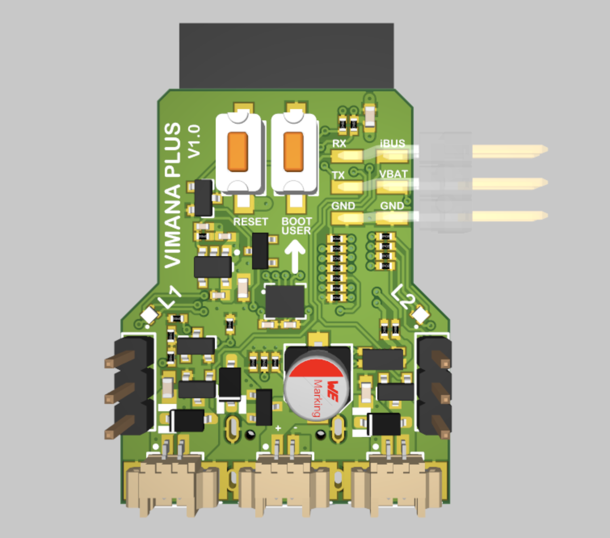

# Vimana Plus hardware design

## Changes to original
There are a couple of differences in the hardware design:
### 1. single SOC
The ESP8266 SOC and N76E003 MCU are replaced by a single ESP32-S3-WROOM module. These are cheap and easily available.
### 2. USB-C Connector
The USB-C connector is used for programming and debugging the ESP32-S3. It connects to the internal USB-JTAG controller. Thus no special programmer is required to upload new firmware on the device.

_Note: The 5V USB will power the SOC and LEDs but not the motors and servos. Those will need an actual battery_

### 3. Battery input protection
There is a reverse polarity protection to protect the delicate electronics from plugging in the battery the wrong way.

For easy debugging there is a low-loss switchover from battery to USB-C power. This is usefull for tinkering on your desk without battery or propellers.

### 4. Two RGB leds
Two seperately controllable RGB leds are added to the board. These can be used for status indication or just for fun. These can also convey more information to the user than the original single color led.

### 5. User-switch
The addition of a switch opens the possibility to add extra functions to the board. For example switching between different flight modes, phone or iBus control, etc.

---

## test report
__Works as expected:__
- ✅ The ESP32-S3 can be programmed and debugged via USB-C
- ✅ The battery switchover works
- ✅ The RGB leds work
- ✅ The motor outputs works (after patch of motor 1, see below)

__Bugs found so far:__
- 🐞 The enable of the LDO is not controlled by GPIO during FW upload or debugging.
- 🐞 There is a unconnected net between GND of the motor 1 mosfet and the rest of the board.
- 🐞 The battery terminal should be replaced by an JST-PH.
- 🐞 Reverse polarity protection is not working. The battery will still short over the mosfet body diode and the freewheeling diode of the motor. (At least the ESP will not blow up.)
- 🐞 Low battery and high motor currents will cause the ESP to brown out.

__Still to be tested:__
- The IMU
- iBus input
- Power consumption
- Servo outputs